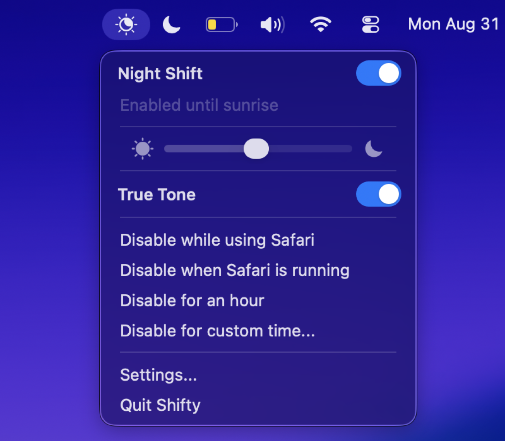
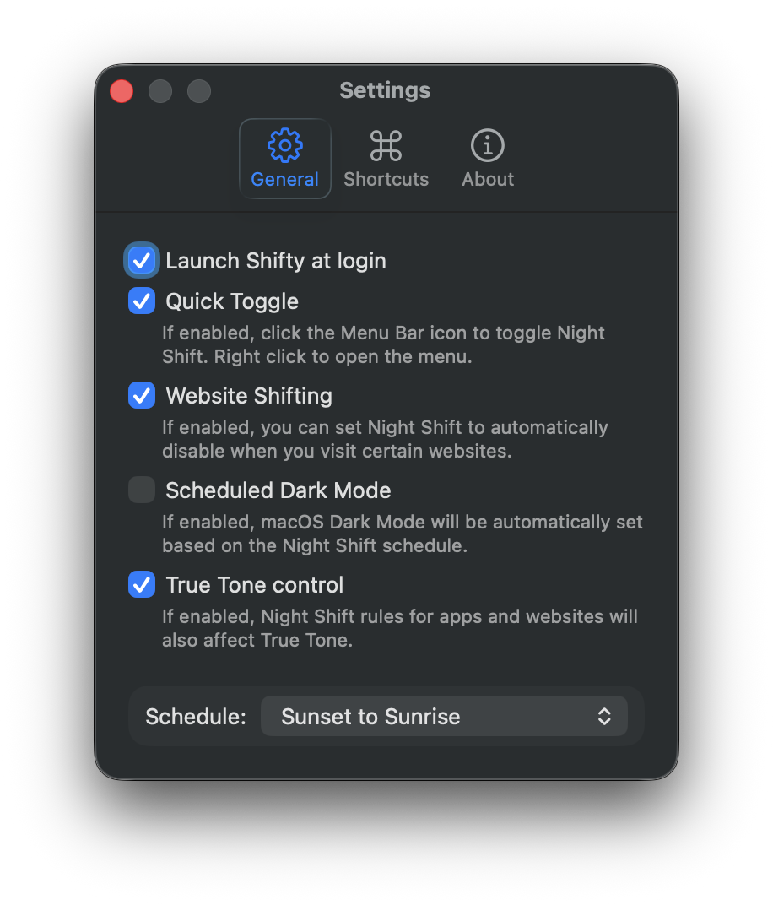
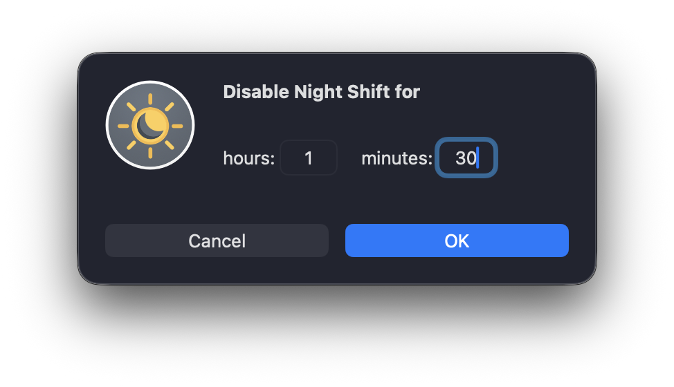

<h1 align="center">
  <br>
  Shifty
</h1>

<p align="center">
  Night Shift, with the controls Apple left out. A menu bar app for macOS.
</p>

<p align="center">
  
</p>

Night Shift is either on or off, on a schedule you barely control. Shifty adds
the rest: turn it off for the app you're in, for the site you're reading, for an
hour, or until you say otherwise, and put a colour temperature slider one click
away.

## Features

- **Per app rules.** Disable Night Shift while you're using an app, or for as
  long as an app is running at all, even in the background.
- **Per site rules.** Disable it for a domain or a single subdomain, in Safari,
  Chrome, Chromium, Edge, Brave, Opera or Vivaldi.
- **Timed pauses.** Disable for an hour, or for a duration you type in.
- **A colour temperature slider** in the menu, rather than buried in Settings.
- **Quick Toggle.** Click the menu bar icon to toggle Night Shift, right click
  for the menu.
- **Dark Mode on the Night Shift schedule**, so the two change together.
- **True Tone control**, with your Night Shift rules applied to it as well.
- **Global keyboard shortcuts** for every common action.

<p align="center">
  
  &nbsp;
  
</p>

## Requirements

- macOS 14 or later, tested on macOS 26
- A Mac that [supports Night Shift](https://support.apple.com/en-us/HT207513#requirements)
- True Tone control needs a [Mac with True Tone](https://support.apple.com/HT208909)
- Website rules need Accessibility and Automation permission, which Shifty asks
  for the first time you enable them

## Building

There are no prebuilt downloads for this fork, and no auto-update. Build it
yourself:

```sh
pod install
open Shifty.xcworkspace
```

`Scripts/archive-and-install.sh` archives a Release build into `build/archives`
and installs it to `/Applications`, which is the quickest way to run your own
build day to day.

## About this fork

A fork of [thompsonate/Shifty](https://github.com/thompsonate/Shifty), whose
last release was in 2021 and which no longer built on current toolchains. This
fork brings it up to date: it builds on Xcode 26, requires macOS 14, and has had
its retired dependencies removed, including Microsoft App Center, which was shut
down in 2025, and Sparkle, which pointed at the upstream update feed. Everything
Shifty does is still Nate Thompson's design and the great majority of the code
is his.

Night Shift and True Tone are driven through private system frameworks, which is
the price of doing any of this at all. It works today; a future version of macOS
could change that.

## License

GPLv3, as upstream. Contributions welcome.

If you'd like to help translate Shifty, upstream collects translations
[here](https://shifty.natethompson.io/translate).
